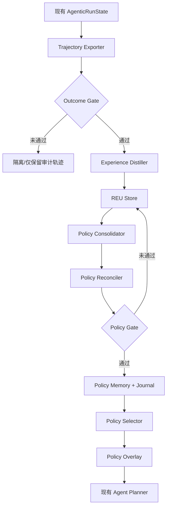

# Step 10-6：现有 Agentic RAG 到 RSI 层的实现映射

> 本文件用于证明方案可实施并指导后续代码，不属于技术交底正文。

## 1. 现有内循环可以直接复用的能力

当前 `kgnpdzpbcg-collab/agentic-RAG` 已有能力可对应专利中的 Agentic RAG 内循环：

| 现有能力 | 当前代码对象 | 专利中的作用 |
|---|---|---|
| 路由与任务规划 | agent route / agent plan | 生成检索任务图 |
| 依赖子任务执行 | AgenticStepResult / step_results | 形成多跳检索轨迹 |
| 混合检索 | hybrid_search | 通用知识召回 |
| 文件限定检索 | search_by_file | 面向手册/规程的定向检索 |
| 页上下文读取 | page_context | 处理表格、跨页或定位类证据 |
| 上下文扩展 | expand_context | 父级/相邻块补全 |
| 证据充分性判断 | context_grader | 内循环是否继续补查 |
| 证据池 | evidence_pool_docs / evidence_pool_changes | 记录检索过程中证据累积 |
| 答案验证 | answer verifier | 最终回答 groundedness |
| 链路验证 | chain verifier | 多跳依赖链有效性 |
| 运行状态 | AgenticRunState / steps | RSI 原始 Retrieval Trajectory |

因此不需要推倒现有代码。专利新增重点在“任务结束之后的跨任务自优化层”。

## 2. 建议新增 RSI 模块

```text
services/rsi/
├── experience_schema.py
├── trajectory_exporter.py
├── experience_distiller.py
├── experience_store.py
├── outcome_gate.py
├── policy_consolidator.py
├── policy_reconciler.py
├── policy_store.py
├── policy_selector.py
├── policy_overlay.py
├── policy_gate.py
└── policy_journal.py
```

### experience_schema.py

定义 REU：

- condition：任务类型、装备/模块、意图、复杂度、所需证据类型；
- action：任务分解、查询扩展、知识源路由、工具序列、上下文扩展、停止条件；
- outcome：证据覆盖、groundedness、chain validity、调用成本/轮次、外部反馈；
- diagnosis：观察到的不足、可能原因、置信度、建议对比动作；
- verification：candidate / verified / reinforced / verified_negative / deprecated；
- provenance：trajectory id、知识库版本、文档版本、planner/retriever 版本。

### trajectory_exporter.py

从 AgenticRunState 导出稳定的跨版本轨迹格式，不直接把内部对象存入长期 memory。

### outcome_gate.py

门控条件示例：

- chain verification 有明确结论；
- answer verifier 或证据评分有可解释结果；
- 轨迹完整；
- 无关键基础设施错误；
- 若仅有人工主观反馈，则不直接晋级为“已验证成功”。

### experience_distiller.py

根据完整轨迹和验证结果提炼 REU。允许从失败中生成 verified_negative，但禁止把失败任务改写成成功规则。

### policy_consolidator.py

针对相似 Condition 的 REU：

1. 聚合重复支持动作；
2. 对比正向和负向动作差异；
3. 形成 candidate policy；
4. 记录 supporting experiences 与 negative evidence。

### policy_reconciler.py

在写入 Policy Memory 前检查：

- 与已有策略是否冲突；
- 是否仅在某个设备型号/文档版本成立；
- 是否需要收缩 scope；
- 是否应分裂为两个策略；
- 是否应降低旧策略可信度；
- 是否应将旧策略标为 deprecated。

### policy_overlay.py

不改写 Base Planner 本身，而是在规划前提供结构化覆盖信息，例如：

```json
{
  "preferred_sources": ["principle_manual", "fault_case", "test_procedure"],
  "query_expansion": ["feedback", "sampling", "regulation"],
  "preferred_tools": ["hybrid_search", "search_by_file", "page_context"],
  "context_policy": "parent_neighbors",
  "required_evidence": ["mechanism", "case", "test_procedure"]
}
```

Planner 仍负责根据当前问题生成具体任务图。

### policy_journal.py

保存：

- policy version；
- 变更前后内容；
- supporting REU；
- 变更原因；
- knowledge-base version；
- 回滚点。

## 3. 建议的数据流



## 4. 与现有 AgenticPolicy 的关系

现有 `AgenticPolicy` 继续承担“单次运行安全边界”，例如 max_steps、max_retries、是否启用 grader/verifier、fallback 等。

新增 RSI Policy 不与其合并：

- **AgenticPolicy**：一次任务能走几步、是否重试、是否降级；
- **RSI Policy Overlay**：针对当前任务，历史已验证经验建议“应该怎么检索”。

这样既避免长期经验直接改写运行安全上限，也让专利中的“策略演化”有清楚的作用对象。

## 5. 最小可实施版本

第一版不需要主动 Curriculum 探索，也不需要强化学习或在线微调。

最低可实施链：

1. 正常运行现有 Agentic RAG；
2. 导出每次任务完整 trajectory；
3. 通过现有 grader/verifier 生成验证结果；
4. 提炼 REU；
5. 对同类 REU 做正负经验对比；
6. 生成少量结构化 policy；
7. 相似新任务先检索 policy，再把 overlay 交给 Planner；
8. 后续验证结果继续更新 policy confidence/scope；
9. 保留 policy journal，可手动或自动回滚。

该版本已经能够验证专利的核心机制，而无需一次性重构整个系统。
