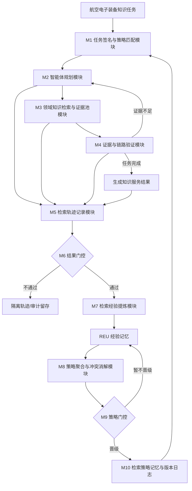
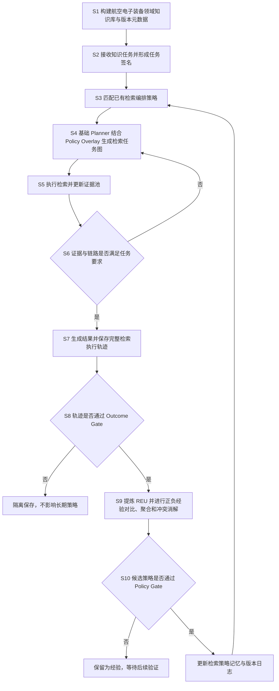

# 技术交底书

**案件名称**：一种面向航空电子装备知识服务的递归自优化检索增强智能体方法及系统

**技术联系人**：
- 姓名：待填写
- 电话：待填写
- 邮箱：待填写

**专利类型**：发明

---

## 注意事项

（1）本交底书用于说明本发明的技术构思、实施方式及欲保护的技术关键点，应使本领域普通技术人员能够据此理解并实施本方案。  
（2）本文中的“RSI-RAG Agent”是“Recursive Self-Improving Retrieval-Augmented Generation Agent”的简称，用于表示本发明所述递归自优化检索增强智能体。  
（3）本文以航空电子装备知识服务为技术环境，所述航空电子装备可包括航空电子电源板、电路板、功能模块及其他航空电子设备；所述知识服务可包括技术资料查询、故障机理解释、故障现象分析、测试规程查询、维修案例检索、参数与判据查询等。  
（4）本发明不以知识图谱为必要技术手段；知识库可采用文档分块、结构化元数据、倒排索引、向量索引及其组合实现。

---

# 一、介绍相关技术背景，描述与本发明技术最相近的现有技术，并说明该现有技术存在的缺点

## 1.1 现有技术

### 1.1.1 反馈驱动的检索增强生成自适应技术

与本发明较接近的现有技术之一为 **CN119226439B《检索增强生成模型的控制方法、装置、设备及可读介质》**。该方案根据用户输入的上下文信息和历史交互数据生成动态适应性关键词集合，提取文档特征，并根据用户对生成结果的反馈调整关键词生成规则、文档特征提取策略；部分实施方式还利用强化学习对生成策略进行优化。

公开链接：<https://patents.google.com/patent/CN119226439B/zh>

该方案已经表明，RAG 系统可以根据历史交互和用户反馈调整后续检索或生成行为。因此，本发明并不把“根据反馈优化 RAG”本身作为区别点。

### 1.1.2 多智能体与 RAG 闭环协同技术

另一接近技术为 **CN121329086A《一种基于多智能体与检索增强生成的智能管理调度系统及方法》**。该方案采用任务智能体、协调智能体和知识智能体，其中知识智能体集成 RAG；任务执行结果反馈用于持续优化任务智能体的决策模型与协调智能体的预测模型，从而构成包含检索、决策、执行和反馈学习的闭环。

公开链接：<https://patents.google.com/patent/CN121329086A/zh>

该方案说明，“Agent + RAG + 执行反馈 + 持续优化”也已经属于公开技术思路。因此，本发明进一步限定到知识检索过程本身的经验结构、策略形成方式以及策略如何作用于后续 Agent 检索任务图。

### 1.1.3 基于正负反馈优化知识库的 RAG 技术

**CN121278042B《检索增强生成的知识库优化方法及系统》**公开了根据用户反馈对问答实例进行正面/负面分类，将实例加入不同知识集合，并利用负面知识集合对后续检索分数进行惩罚性调整。

公开链接：<https://patents.google.com/patent/CN121278042B/zh>

该方案与本发明均涉及“历史经验影响未来检索”，但其主要处理对象是问答对及正负知识集合，本发明则把一次完整检索过程作为经验对象，并对检索动作进行对比、聚合和策略化。

### 1.1.4 航空电子/航空维修知识技术

**CN118093785A《一种面向分布式协同的航空电子故障知识融合方法》**公开了航空电子装备多源故障知识处理、不同时间线和不同来源之间的知识冲突处理以及故障知识图谱构建。

公开链接：<https://patents.google.com/patent/CN118093785A/zh>

**CN121542436A《一种航空维修知识图谱构建方法、系统、设备及介质》**公开了航空维修文本知识抽取、知识图谱增量更新、用户反馈闭环及智能问答。

公开链接：<https://patents.google.com/patent/CN121542436A/zh>

上述技术说明，航空维修和航空电子知识的融合、更新和智能问答本身已有技术基础，但主要围绕知识融合、知识图谱或知识内容更新展开，并未把经过验证的 RAG 检索轨迹进一步演化为能够直接改变后续智能体检索任务图的检索编排策略作为主技术对象。

### 1.1.5 递归自优化智能体技术背景

RSIAgent 公开了一种无需更新基础模型参数的递归自优化智能体框架，其通过 Actor 执行、Verifier 验证、Curriculum 选择后续探索，并将经过验证的条件—行动—结果经验沉淀到持久化 memory 中，供后续任务复用。其公开源码中还包括 memory distillation、memory reconciliation、日志及恢复边界等机制。

论文：<https://arxiv.org/abs/2609.15364>  
源码：<https://github.com/AetherLabsAI/RSIAgent>

本发明借鉴“经过验证的经验可改变未来智能体行为”这一上位思想，但把优化对象限定为航空电子装备知识服务中的**知识获取过程**，并进一步规定检索轨迹、检索经验单元、检索编排策略、策略覆盖层以及双门控/版本回滚之间的作用关系。

### 1.1.6 最接近的现有技术及逐特征比对

本案暂以 **CN119226439B** 作为最接近的现有技术（D1），原因在于其已经明确公开“历史交互/反馈 → 改变后续 RAG 检索或生成策略”的技术起点。

| 编号 | 技术维度 | D1 的公开方式 | 本发明的方式 |
|---|---|---|---|
| F1 | 可复用经验的对象 | 主要根据用户反馈调整关键词生成规则、文档特征提取策略和生成策略 | 记录一次任务中的完整检索执行轨迹，在独立验证后形成检索经验单元 REU；REU 包含任务条件、检索动作、执行结果、策略效果诊断、验证状态及来源/知识库版本 |
| F2 | 跨任务策略形成方式 | 反馈达到条件后调整相关模型或规则策略 | 对条件相近的正向与负向 REU 进行检索动作对比，对多条经验聚合并执行策略冲突消解，形成带适用范围、可信度、支持经验、反例及版本信息的检索编排策略 |
| F3 | 对后续 Agent 的作用位置 | 以关键词、文档特征和生成策略调整为主 | 保留基础 Planner，将匹配的检索编排策略作为 Policy Overlay 作用于检索任务图，改变任务分解、查询扩展、知识源路由、工具序列、上下文扩展方式或停止条件中的至少一项 |
| F4 | 自优化过程的防污染与可逆性 | 根据反馈结果触发相关策略调整 | 设置 Outcome Gate 与 Policy Gate，区分原始轨迹、已验证经验和已晋级策略；策略更新记录知识库版本、支持经验和反例，并允许后续冲突时收缩适用范围、降权、失效或回滚 |

**特征一览：**

- **F1 已验证检索经验单元**：把完整检索执行轨迹转化为结构化、可追踪且带验证状态的 REU，而非仅保存问答记录或用户评分。
- **F2 对比聚合与策略协调**：从多条正负检索经验中提炼稳定检索行为，并通过冲突消解形成具有适用范围与可信度的检索编排策略。
- **F3 Policy Overlay 驱动未来 Agent 规划**：将已晋级策略以覆盖信息作用于基础 Planner，使跨任务经验直接改变后续检索任务图。
- **F4 双门控和版本化回滚**：只有满足验证边界的轨迹和经验才可晋级到长期策略层，并保留后续降权、失效和回滚路径。

## 1.2 现有技术存在的缺点

1. D1 虽能够根据用户反馈调整关键词规则、文档特征提取策略和生成策略，但其没有把一次复杂知识任务中的任务分解、知识源选择、工具调用、上下文扩展、停止判断和证据验证作为一个完整可复用经验对象，因此难以把“某类任务为什么应采用某种检索路径”的已验证经验稳定迁移到后续相似任务。（F1）

2. D1 主要由反馈触发策略调整，而 D3 主要通过正负知识集合影响后续检索分数；对于多轮 Agentic RAG 而言，单条成功/失败记录可能仅由偶然文档命中或特定版本环境造成，若直接写入长期 memory，容易将局部经验过度泛化，且已有策略之间发生冲突时缺少针对检索编排策略的适用范围协调。（F2）

3. D2 已经能够形成 Agent + RAG + 反馈学习闭环，但其反馈主要用于优化任务智能体或协调智能体的决策/预测模型，并没有规定“历史检索经验如何以结构化策略直接改变未来检索任务图”的作用接口。因此 Agent 在面对相似知识任务时仍可能重复进行从零规划，造成重复检索、知识源路由波动和不必要的上下文扩展。（F3）

4. RSIAgent 已经说明验证后经验可用于未来任务，但在航空电子知识服务中，知识库文档存在版本变化、设备型号差异、规程更新和相似故障现象等情况。如果缺少经验晋级门控、来源版本追踪和策略版本回滚机制，错误或过时经验一旦进入长期策略层，可能在后续多个任务中持续放大。（F4）

---

# 二、针对上述缺点，说明本发明所要解决的技术问题

1. 如何使航空电子装备知识服务系统在多源技术文档、专业术语及复杂多跳问题环境下，能够利用已经验证的历史执行结果，减少相似知识任务中的重复无效检索，并提高所需证据覆盖的稳定性。

2. 如何在长期任务积累过程中区分稳定可复用的检索经验与偶发、错误或过时的任务结果，并在经验之间出现冲突时维持长期知识获取行为的一致性和可控性。

3. 如何在不要求频繁更新基础大模型参数的条件下，使智能体的知识获取行为能够随任务积累和知识库版本变化持续适配，同时使每次策略变化具有明确来源、适用边界和恢复路径。

---

# 三、本发明技术方案的详细阐述

## 3.1 背景

### 3.1.1 场景与参与者

本发明面向航空电子装备知识服务环境。系统中的知识服务对象可以是航空电子电源板、电路板、控制模块、接口模块、通信模块及其他航空电子设备。使用者可以是维修人员、测试人员、研发人员或其他需要查询航空电子技术知识的人员。系统处理的知识资料包括但不限于技术手册、工作原理资料、维修手册、故障隔离资料、历史故障案例、测试规程、器件说明、技术通告及版本变更记录。

知识服务请求可以是简单参数查询，也可以是需要跨多个资料来源完成的复杂问题，例如“某电源模块某路输出异常可能涉及哪些环节，应查阅哪些测试步骤和判据”。本发明重点解决的是系统如何在多次此类知识任务之间积累和复用**检索行为经验**，而不是单纯扩充知识内容。

### 3.1.2 航空电子装备知识如何进入系统

系统首先对航空电子领域资料进行解析和索引。每个文档片段除文本内容外，可关联文档类型、装备型号、功能模块、文档版本、章节/页码、发布日期或有效期等元数据。系统可同时建立倒排索引和向量索引，并可配置重排序器。

本发明不要求构建知识图谱。对于“设备—模块—文档类型—版本”等关系，可通过元数据字段、标签和索引过滤完成。

### 3.1.3 后文高频术语定义

**知识任务**：用户提出的一次航空电子装备知识请求及其在系统内形成的检索、证据组织和回答过程。

**任务签名**：从当前知识任务中提取的结构化任务描述，用于表征任务类型、装备/模块范围、用户意图、复杂度、所需证据类型及已知限定条件。

**检索任务图**：智能体对复杂知识任务进行分解后形成的子检索任务及其依赖关系。无依赖子任务可并行执行，有依赖子任务按照前序结果继续检索。

**证据池**：一次知识任务中经检索、重排序和上下文扩展后保留的候选证据集合，用于支持中间结论和最终回答。

**检索执行轨迹**：从任务签名形成开始，到检索任务图生成、查询重写、知识源选择、工具调用、证据池变化、充分性判断、补查、最终验证结束的全过程记录。

**检索经验单元（REU）**：由经过可靠验证的检索执行轨迹提炼得到的长期经验对象，用于描述“在什么条件下采用了什么检索动作、得到什么结果、该动作为什么值得保留或避免以及该结论由何种证据验证”。

**检索编排策略**：由多条已验证 REU 聚合后形成的、具有适用范围和可信度的可复用策略，用于指导后续智能体如何分解问题、扩展查询、选择知识源、选择检索工具、扩展上下文和判断停止。

**Policy Overlay（策略覆盖信息）**：针对当前任务从长期策略记忆中匹配到的检索编排策略的结构化表示。该信息不替换基础 Planner，而作为额外约束或偏好参与当前检索任务图的生成。

## 3.2 系统框图

图1示出了本发明一实施方式的系统总体结构。

该系统具有两个相互连接但时间尺度不同的闭环：

第一闭环为**当前任务内循环**，由 M2、M3、M4 构成，负责当前问题的规划、检索、证据判断及必要时的重规划。

第二闭环为**跨任务递归自优化外循环**，由 M5 至 M10 构成，负责把经过验证的检索执行轨迹转换为长期可复用策略，并在未来任务中重新作用于 M1/M2。

## 3.3 模块功能说明

### M1 任务签名与策略匹配模块

该模块从用户请求中确定知识任务类型、装备对象、模块范围、任务意图、复杂度、已知限定条件和所需证据类型，并形成任务签名。

该模块同时访问检索策略记忆，根据任务签名与已有策略的适用范围进行匹配。匹配结果作为 Policy Overlay 发送给 M2。若没有满足条件的已晋级策略，则 M2 仅使用基础规划逻辑。

### M2 智能体规划模块

该模块根据原始问题、任务签名以及可选的 Policy Overlay 生成检索任务图。

对于简单参数查询，可生成单个检索任务；对于故障原因分析、测试步骤定位、跨手册比对等复杂请求，可分解为多个并行或有依赖关系的检索子任务。

Policy Overlay 可向该模块提供知识源优先级、查询扩展方向、优选工具、证据覆盖要求或停止偏好，但不直接给出最终回答，从而保持基础 Planner 对当前任务上下文的适应能力。

### M3 领域知识检索与证据池模块

该模块调用一种或多种检索工具获取航空电子装备领域证据。可采用关键词检索、向量检索、混合检索、重排序、限定文档检索、指定页附近上下文检索以及父块/相邻块扩展。

检索结果经去重、重排序或上下文扩展后加入证据池。证据池记录新增、替换和淘汰情况，供后续证据验证和检索轨迹记录使用。

### M4 证据与链路验证模块

该模块独立于当前检索 Planner，对以下至少一项进行检查：

1. 当前证据是否直接覆盖任务所需信息；
2. 每个子任务是否获得足够证据；
3. 依赖型子任务是否正确使用前序子任务的已验证结果；
4. 最终回答中的关键事实是否具有证据支持；
5. 是否仍缺少工作原理、故障案例、测试步骤、参数判据或版本适用性等任务所需证据。

若证据不足，则把缺失证据类型、建议查询或建议工具返回 M2/M3 进入补查内循环。若满足结束条件，则允许生成或确认最终知识服务结果。

### M5 检索轨迹记录模块

该模块以结构化形式记录一次任务的全过程，包括但不限于：

- 原始问题及任务签名；
- 检索任务图及依赖关系；
- 每轮关键词查询和语义查询；
- 每次知识源选择和检索工具调用；
- 召回文档、重排序结果和上下文扩展；
- 证据池变化；
- 每轮证据充分性结果；
- 中间结论和依赖链验证结果；
- 最终回答验证结果；
- 调用次数、重试次数、上下文规模等运行信息；
- 本次任务使用的知识库版本、文档版本和规划/检索组件版本。

该模块只记录事实轨迹，不直接认定某个检索动作是正确策略。

### M6 结果门控

M6 用于判断一条轨迹是否具备进入长期经验提炼阶段的基础条件。

在一些实施方式中，以下情况可阻止轨迹晋级：

- 当前任务没有形成可靠的证据/链路验证结论；
- 运行过程中存在关键基础设施错误，无法区分策略失败和系统异常；
- 最终回答被判定为未获得证据支持；
- 知识库版本或任务输入缺失导致轨迹不完整。

未通过 M6 的轨迹可以保留用于审计或调试，但不直接生成会影响未来 Agent 的长期策略。

### M7 检索经验提炼模块

通过 M6 的轨迹被提炼为 REU。优选地，一个 REU 包含以下六类信息：

| 类别 | 内容 |
|---|---|
| 任务条件 Condition | 任务类型、装备类型、模块范围、意图、复杂度、所需证据类型及限制条件 |
| 检索动作 Action | 任务分解、查询扩展、知识源路由、工具调用序列、上下文扩展方式、停止条件 |
| 执行结果 Outcome | 证据覆盖情况、链路验证结果、最终回答支持情况、调用/重试情况及可选外部反馈 |
| 策略效果诊断 Diagnosis | 已观察到的缺失、可解释的策略效果、尚未证实的原因假设及建议对比动作 |
| 验证状态 Verification | 候选、已验证、已验证负向、重复支持、失效等状态 |
| 来源 Provenance | 轨迹标识、知识库版本、文档版本、规划/检索组件版本及验证来源 |

策略效果诊断与已观察结果分开保存。对于失败轨迹，系统可以形成“已验证负向经验”，用于说明某类检索动作在当前条件下未满足证据要求，但不得把失败结果改写成已经验证的成功规则。

### M8 策略聚合与冲突消解模块

M8 从 REU 记忆中选择任务条件相近的经验，进行以下处理：

1. **重复支持聚合**：若多次已验证任务在相近条件下采用相似检索动作并获得稳定结果，则提高该动作形成长期策略的依据强度。
2. **正负经验对比**：比较相似任务中成功与失败检索动作的差异，识别可能导致证据覆盖变化的知识源、查询扩展、工具序列或停止方式。
3. **适用范围归纳**：把可复用策略限制在明确任务类型、装备/模块、知识需求或文档版本范围内。
4. **冲突消解**：当新经验与已有策略矛盾时，根据来源版本、验证质量和反例情况，对旧策略执行适用范围收缩、策略分裂、可信度降低、替换或失效。
5. **例外保留**：对于存在明确反例的策略，将反例或不适用条件与策略共同存储，避免“成功一次即可全局推广”。

### M9 策略门控

M9 判断候选策略是否可以正式影响后续 Agent。

候选策略可基于以下至少一种条件晋级：

- 获得多条独立已验证 REU 的重复支持；
- 获得正负经验对比的差异支持；
- 由具有较高可信来源的任务结果验证；
- 不与当前高可信策略产生未解决冲突；
- 适用范围和知识库版本已明确。

未通过策略门控的候选策略仍可作为经验保留，但不进入可直接匹配未来任务的长期策略集合。

### M10 检索策略记忆与版本日志

正式晋级的检索编排策略优选包含：

- 策略标识；
- 适用范围；
- 对 Agent 的策略修改内容；
- 可信度或可信等级；
- 支持该策略的 REU；
- 已知反例/不适用条件；
- 知识库及文档版本范围；
- 创建时间、更新时间和策略版本；
- 上一版本或可回滚版本。

每次策略变更均写入版本日志。若后续任务持续产生负向验证结果，系统可以降低策略优先级、限制适用范围、标记失效或回滚到历史版本。

## 3.4 系统流程说明

图2示出了本发明一实施方式的方法流程。

### S1 构建航空电子装备领域知识库与版本元数据

采集航空电子装备相关技术资料，对文档进行解析、分块和索引，并记录文档类型、装备型号、功能模块、版本、章节/页码、有效期等元数据。可以建立关键词索引、向量索引及重排序能力。

### S2 接收知识任务并形成任务签名

接收用户问题，识别其属于参数查询、机理解释、故障原因分析、测试步骤查询、维修案例查询或其他知识任务，并确定装备/模块范围、用户意图、复杂度以及所需证据类型。

### S3 匹配已有检索编排策略

根据任务签名检索长期策略记忆。匹配时优先考虑任务语义相似性以及装备类型、模块对象、任务意图、知识需求类型和文档版本等条件。

若不存在满足适用范围要求的策略，则本次任务从基础 Planner 开始；若存在多个策略，则可根据可信等级、适用范围一致程度、版本有效性和已知反例情况选择一个或多个策略形成 Policy Overlay。

### S4 基础 Planner 结合 Policy Overlay 生成检索任务图

基础 Planner 根据当前问题生成检索任务图。

在存在 Policy Overlay 时，Planner 可据此：

- 增加或减少某类子检索任务；
- 增加专业术语或同义术语扩展；
- 优先选择特定类型的知识源；
- 优先调用特定检索工具；
- 选择父块或相邻页上下文扩展；
- 修改证据覆盖要求或停止条件。

Policy Overlay 为规划偏好或约束，而不是直接替换 Planner 输出，从而避免长期策略机械套用到不适用的新问题。

### S5 执行检索并更新证据池

按照检索任务图执行各子任务。每次检索结果经去重、重排序、必要的上下文扩展后加入证据池，并记录本次工具调用及证据池变化。

### S6 判断证据与链路是否满足任务要求

对证据池进行独立判断。如果问题要求工作原理、故障案例和测试步骤三类证据，而当前只覆盖其中两类，则判定仍不充分，并把缺失证据及建议查询方向返回 S4 或 S5。

对于存在依赖关系的任务，还检查后续子任务是否使用经过验证的前序结果。只有所需证据达到任务要求且最终结论具有证据支持时，才进入 S7。

### S7 生成结果并保存完整检索执行轨迹

生成最终知识服务结果，同时固化本次任务的任务签名、任务图、查询、知识源、工具调用、证据池变化、验证结果、调用成本及版本信息，得到完整检索执行轨迹。

### S8 Outcome Gate 判断

判断本次轨迹是否足以用于长期学习。

若本次任务因服务异常中断、缺少可靠验证、最终答案未被证据支持或轨迹字段不完整，则只保留审计记录，不进入策略学习。

若结果为已验证成功，则可形成正向 REU；若结果为已验证失败且失败证据明确，则可形成负向 REU。

### S9 提炼 REU，并执行对比、聚合和冲突消解

根据完整轨迹生成 REU。

系统进一步查找适用条件相近的历史 REU，对正向经验和负向经验进行检索动作对比。例如，在相同“电源输出异常原因分析”任务中，历史失败轨迹只进行了全局语义检索，而成功轨迹增加了工作原理手册、反馈控制相关查询和测试规程检索，则该差异可以作为候选策略的形成依据。

对于与已有策略冲突的新经验，优先确定冲突是否由设备型号、文档版本、任务意图或知识需求不同造成。若属于条件差异，则收缩或拆分策略适用范围；若属于旧策略确实失效，则降低其可信度或标记失效。

### S10 Policy Gate 与策略版本更新

判断候选策略是否具有足够依据进入长期策略记忆。通过后，为策略记录适用范围、修改内容、支持经验、反例和版本信息，并生成新的策略版本。

后续任务再次执行 S3 时将使用更新后的策略集合，因此当前任务的已验证经验能够通过长期策略记忆影响未来任务，构成递归自优化。

## 3.5 关键技术参数与配置项

本发明不要求固定数值。以下参数均可根据知识库规模、历史任务统计或离线验证结果配置：

| 参数类别 | 含义 | 获得方式及调整影响 |
|---|---|---|
| 任务—策略匹配阈值 | 判断历史策略是否适用于当前任务 | 可通过历史任务验证集确定；提高阈值可减少错误复用，但会增加从基础 Planner 冷启动的任务比例 |
| 证据充分性门槛 | 判断当前证据是否覆盖所需信息 | 可根据任务类型定义，例如参数查询、机理解释和测试步骤查询采用不同覆盖条件；提高门槛会增加补查轮数 |
| Outcome Gate 条件 | 判断轨迹是否能生成长期经验 | 可要求存在链路验证、答案支持验证和完整版本信息；条件越严格，经验污染概率越低，但经验积累速度降低 |
| Policy Gate 条件 | 判断候选策略能否影响未来 Agent | 可要求重复验证、正负对比支持或高可信来源支持；条件越严格，策略更新越稳定 |
| 最大补查轮数 | 限制当前任务内循环计算开销 | 由响应时延和知识复杂度折中确定；超过上限时输出证据不足状态而不是无限循环 |
| 策略有效版本范围 | 指定策略适用于哪些知识库/文档版本 | 根据文档版本元数据自动更新；版本变化可触发重新验证或策略降级 |
| 策略可信等级 | 表示策略受历史验证支持的程度 | 根据支持 REU、反例、近期验证结果和来源可靠性增减，不要求采用某一固定计算公式 |

---

# 四、与现有技术相比，本发明具有哪些优点

1. 本发明不是简单保存历史问答，而是把任务条件、检索动作、证据结果、验证状态和版本来源共同组织为检索经验单元，使一次 Agentic RAG 任务中真正与知识获取相关的行为能够被跨任务追踪和复用，从而减少相似任务反复从零规划造成的重复检索。（F1）

2. 本发明不是“成功一次即写入规则”，而是对条件相近的正向和负向经验进行检索动作对比，并对多条经验进行聚合、适用范围限定和冲突消解，因此能够降低偶发文档命中、特定型号或特定版本造成的经验过度泛化。（F2）

3. 本发明将长期经验形成的检索编排策略作为 Policy Overlay 作用于基础 Planner，而不是仅作为聊天上下文附加信息，使历史经验能够直接改变后续任务的任务分解、查询扩展、知识源路由、工具调用、上下文扩展和停止条件，能够在保留 Agent 当前任务适应能力的同时减少检索路径波动和无效调用。（F3）

4. 本发明通过 Outcome Gate 和 Policy Gate 把“原始运行轨迹、已验证经验、可影响未来任务的策略”分层管理，并通过策略版本日志记录支持经验、反例和知识库版本，从而在错误经验或知识版本变化导致策略退化时能够执行降权、失效或回滚，降低递归自优化中的错误累积风险。（F4）

5. 本发明将航空电子装备型号、功能模块、任务意图、知识需求类型和文档版本加入策略适用范围，使同一套 RSI-RAG Agent 能够在维修手册、原理资料、测试规程、故障案例等多类资料之间形成稳定的知识获取路径，而不要求额外构建知识图谱。

6. 本发明的递归自优化发生在智能体编排和长期检索经验层，不要求频繁重新训练基础大语言模型，因此便于在私有航空电子知识环境中部署，也便于对每次策略变化进行审计。

上述 F1—F4 并非相互独立的简单拼接：F1 提供经验证的经验载体，F2 把多个经验转化为可泛化策略，F3 建立长期策略影响未来 Agent 的作用接口，F4 约束这一自优化过程的可靠性和可逆性。缺少任一环节，均会使“已验证经验持续改善未来知识获取行为”的闭环不完整。

---

# 五、本发明的技术关键点和欲保护点是什么

## 5.1 独立保护构思（必要技术特征）

- **F1 已验证检索经验单元机制**：对航空电子装备知识任务中的检索任务图、查询、知识源、工具调用、证据池变化及验证结果形成完整检索执行轨迹；在轨迹通过结果门控后，将其提炼为至少包含任务条件、检索动作、执行结果、策略效果诊断、验证状态及来源版本的检索经验单元。（对应 3.3 的 M5—M7、3.4 的 S7—S9）

- **F2 基于多经验对比和冲突消解的检索编排策略形成机制**：对适用条件相近的正向和负向检索经验单元进行检索动作对比，对多条已验证经验进行聚合，并对新旧策略间的冲突进行适用范围收缩、策略分裂、可信度调整、替换或失效处理，以形成具有适用范围、支持经验、反例和版本信息的检索编排策略。（对应 3.3 的 M8、3.4 的 S9）

- **F3 检索编排策略对后续智能体规划的策略覆盖机制**：根据当前任务签名匹配已晋级的检索编排策略，并将匹配结果作为 Policy Overlay 作用于基础 Planner，使后续检索任务图中的任务分解、查询扩展、知识源路由、检索工具序列、上下文扩展方式或停止条件中的至少一项随历史已验证经验发生变化。（对应 3.3 的 M1—M3、3.4 的 S2—S5）

- **F4 受验证约束的策略晋级和版本化回滚机制**：通过 Outcome Gate 限制原始任务轨迹进入长期经验层，通过 Policy Gate 限制候选经验进入可影响未来任务的策略层，并为检索编排策略记录知识库/文档版本、支持经验、反例及变更日志，使策略在后续冲突验证或版本变化时能够被限定、降权、失效或回滚。（对应 3.3 的 M6、M9、M10，3.4 的 S8—S10）

### 总的发明构思

上述必要技术特征围绕同一总构思：**把当前任务中经过验证的检索行为转化为有边界的长期检索策略，并以可审计、可回滚的方式使该策略直接改变未来智能体的知识获取过程。**

## 5.2 优选特征

以下内容可作为优选实施方式，不作为 F1—F4 的必要限定：

- 检索工具采用 BM25、向量检索、混合检索及重排序器的任一种或组合；
- 对显式指定手册、规程或文件的问题优先采用限定文件检索；
- 对跨页表格、公式说明或上下文截断情形采用父块或相邻页扩展；
- 策略匹配同时使用自然语言语义相似度和装备/模块/任务类型等元数据；
- 外部反馈可包括用户确认、专家审核或后续维修结果，但不要求每个 REU 都必须有人工作为验证信号；
- 对高风险任务可要求更严格的 Policy Gate，对简单参数查询采用较低计算开销的基础 RAG 路径；
- 策略可信等级可随正向支持增加、负向反例增加或知识库版本变化动态调整；
- 可将未通过门控的轨迹存入隔离区，仅用于调试、审计或后续离线分析；
- 基础大模型、向量模型和重排序模型可以替换，本发明不以具体模型型号为限制。

---

# 六、其它

## 6.1 实施例一：航空电子电源模块输出异常原因分析

### 初次任务

用户提出：“某多路 DC/DC 电源模块的某一路输出电压持续偏低，应该从哪些环节分析，并给出可查证的测试步骤？”

系统在 S2 形成任务签名：

- 任务类型：故障原因分析；
- 装备范围：航空电子电源模块；
- 任务意图：原因分析 + 测试步骤；
- 复杂度：多跳；
- 所需证据：工作原理、故障/维修案例、测试规程或参数判据。

假设当前尚无匹配长期策略，则基础 Planner 在 S4 生成初始检索任务，例如先进行全局混合检索获取“输出电压偏低”相关资料。

第一次检索返回了若干故障案例，但 M4 判断证据池中只有“现象和可能原因”，缺少反馈调节原理和可执行测试步骤，因此返回“缺少工作原理和测试规程证据”，并建议继续检索。

Planner 随后增加两个子任务：

1. 检索反馈采样、稳压调节或误差放大相关原理资料；
2. 检索对应型号或同类模块的测试规程、测试点和正常范围。

证据满足要求后生成最终回答，并把任务签名、两轮检索任务图、查询扩展、知识源、工具调用、证据池变化、缺失证据判断和最终验证结果固化为完整检索执行轨迹。

### REU 形成

若 Outcome Gate 通过，则形成正向 REU。其中 Action 部分记录：

- 从“输出电压偏低”扩展到反馈采样、稳压调节等专业检索方向；
- 将知识源从一般故障案例扩展到工作原理资料和测试规程；
- 在测试规程命中文档后采用指定页上下文扩展；
- 停止条件为“原因机理 + 测试方法 + 判据证据均已覆盖”。

如果历史中存在一条相似负向 REU，例如只做全局 Dense Retrieval 后回答但被验证为测试步骤不足，则 M8 比较两条轨迹，可形成候选策略：

> 对“航空电子电源模块输出异常原因分析 + 需要测试步骤”的任务，优先形成“工作原理 → 故障案例 → 测试规程”的多源检索路径，并在查询扩展中加入反馈/采样/稳压等控制环节术语。

该候选策略获得重复支持并通过 Policy Gate 后进入长期策略记忆。

### 后续相似任务

后续用户询问：“另一输出通道在带载时电压下降，应如何查资料确认原因？”

S3 根据任务签名匹配到上述策略。M1 把其形成 Policy Overlay 发送给 M2。基础 Planner 因而不再仅从通用语义检索开始，而直接把工作原理、故障案例和测试规程组织为多源任务图，同时保留根据本次具体问题调整子任务的能力。

本实施例的技术效果是减少类似任务中已经被历史证明无效的单一路径重复尝试，并提高机理证据和测试证据同时覆盖的稳定性。

## 6.2 实施例二：文档版本更新引起的策略冲突与回滚

系统中存在一条针对某型航空电子模块的历史策略 P1：当查询某类接口自检异常时，优先检索旧版维修手册中的指定章节，再检索历史案例。

知识库后续加入新版手册。新版手册调整了故障隔离流程，相同异常码已经不再采用原有章节和测试顺序。

在新版知识库下，多个任务按照 P1 检索后均出现“旧版章节相关但测试程序与新版要求不一致”的负向验证结果。这些轨迹经 Outcome Gate 进入负向 REU。

M8 在冲突消解时发现：

- P1 的支持经验主要来自旧版知识库；
- 新负向经验均来自新版手册；
- 冲突与知识库/手册版本具有稳定对应关系。

因此系统不简单删除全部历史经验，而可执行以下任一种处理：

1. 将 P1 的适用范围限定为旧版文档；
2. 生成新版策略 P2，优先检索新版手册及对应测试程序；
3. 降低 P1 在未明确版本任务中的优先级；
4. 若 P2 后续验证失败，则根据策略版本日志回滚至上一稳定策略或重新使用基础 Planner。

本实施例说明，本发明的递归自优化不是不可控在线修改，而是受版本和验证约束的可逆策略演化。

## 6.3 实施例三：简单参数查询的轻量分支

用户提出：“某航空电子模块额定输入电压范围是多少？”

S2 识别为单一事实/参数查询，所需证据仅为权威技术手册中的参数条目。即使策略记忆中存在复杂故障分析策略，其 Scope 与当前任务不匹配，因此 S3 不返回复杂 Policy Overlay。

基础 Planner 仅生成一个限定手册或高可信文档的检索任务，命中参数后由 M4 验证数值和来源，直接结束当前任务。

该轨迹即使被记录，也不应因为“成功”就使复杂故障分析策略扩展到参数查询场景。M8 在经验聚合时通过任务类型和知识需求边界保持策略隔离。

本实施例说明，策略复用受到适用范围控制，递归自优化不会机械地把所有历史经验套用到所有问题。

## 6.4 可观测技术效果与后续验证指标

在后续软件实现与测试中，可以采用以下指标验证本发明技术效果：

- 相似任务在有/无 Policy Overlay 情况下的平均检索工具调用次数；
- 重复无效查询或重复召回比例；
- 所需证据类型覆盖率；
- 最终回答被证据支持的比例；
- 内循环补查次数；
- 因过时策略导致的负向验证次数；
- 策略晋级后再次被降权/失效/回滚的次数；
- 不同知识库版本下策略适用范围的一致性。

上述指标用于说明实施效果，不限定本发明保护范围。
